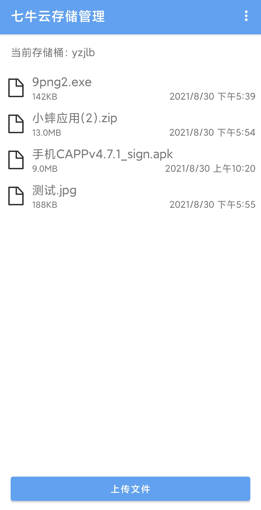
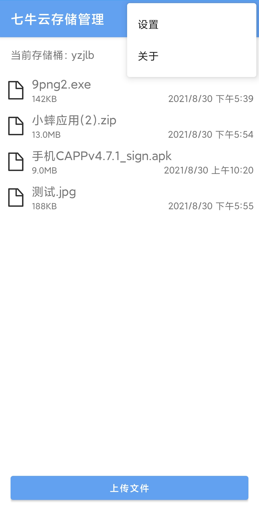

# 七牛云存储管理APP

这是一个用来管理七牛云存储的小工具，使用之前需要设置好accessKey以及secretKey等，然后就可以进行操作了。

| 主界面                   | 菜单                   | 设置                   |
| ------------------------ | ---------------------- | ---------------------- |
|  |  |  |

目前支持以下操作：
- 获取文件列表

- 删除文件

- 文件重命名

- 上传文件

- 复制文件链接

  

## apk下载：

[http://file.yzjlb.net/%E4%B8%83%E7%89%9B%E4%BA%91%E5%AD%98%E5%82%A8%E7%AE%A1%E7%90%86_dev3.apk](http://file.yzjlb.net/%E4%B8%83%E7%89%9B%E4%BA%91%E5%AD%98%E5%82%A8%E7%AE%A1%E7%90%86_dev3.apk) 

